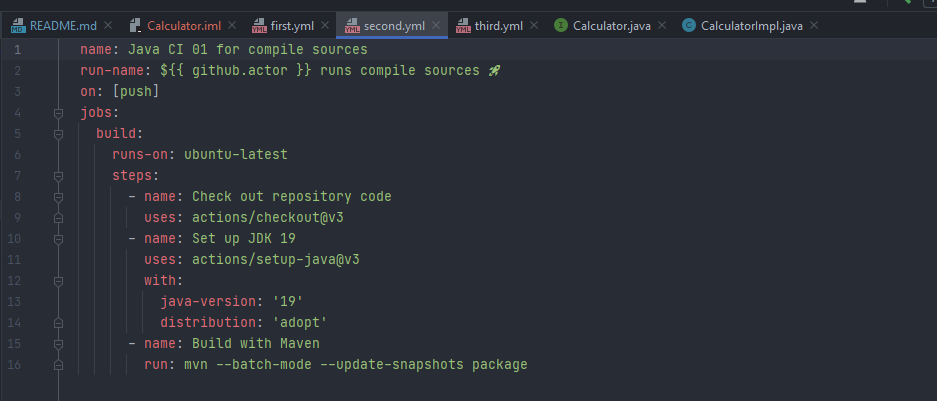
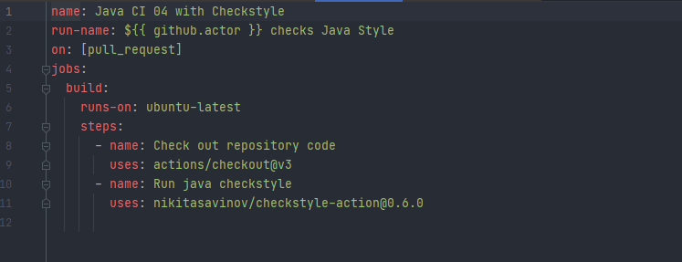
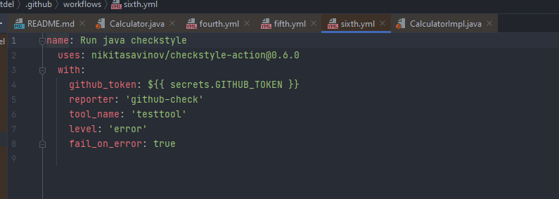
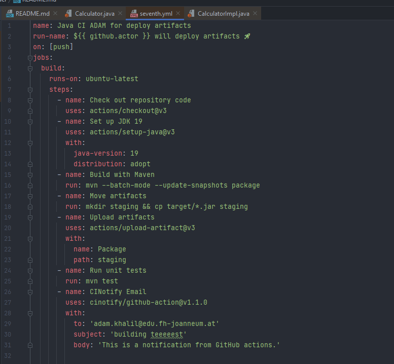
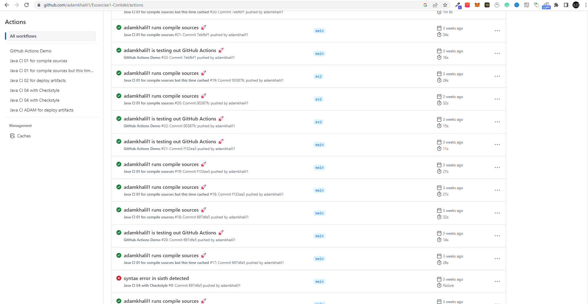
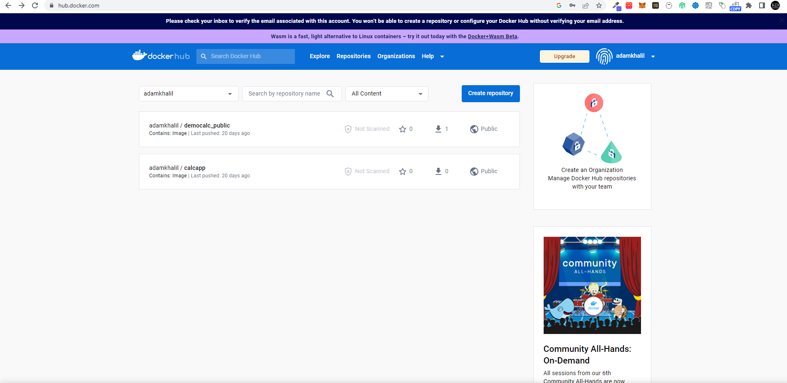
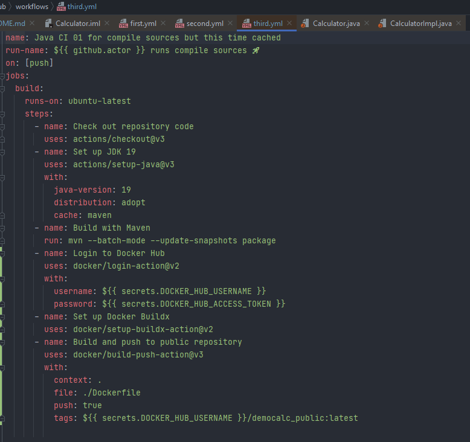

# Exercise one using Calculator Example 1.2 

Upgraded, tested and cleaned for Continuous Delivery Pipeline testing

## Installation

no special installation needed, currently upgraded Tools Version for 1.2
- Maven 3.8.6
- JDK 19.0.1

```bash
mvn clean
```

## Usage

```bash
mvn test
```

## Contributing

Pull requests are welcome. For major changes, please open an issue first
to discuss what you would like to change.

Please make sure to update tests as appropriate.

## License

[GNU GPLv3](https://choosealicense.com/licenses/gpl-3.0/)

# Dokumenation 
## Dokumenation Excercise 1
ALLE Schritte konnten ohne gröbere Vorkomnnisse(syntax fixes) erledigt werde.
(Bennenung bitte ignorieren) aber im seventh.yml befinden sich der eigene Workflow 

**Überlegen Sie sich, wie Sie die einzelnen Schritte (compile und test) separat als
steps abbilden können. Wäre das vorteilhaft? Begründen Sie Ihre Antwort.**

Trennen der Schritte von Kompilieren und Testen in separate Schritte in einem GitHub Actions Workflow kann vorteilhaft sein.

**Isolation**: Durch das Trennen der Schritte erhält man eine größere Kontrolle und Isolation jedes 
einzelnen Schrittes, was nützlich sein kann beim Debugging und Fehlersuche.

**Wiederverwendbarkeit**: Durch das Trennen der Schritte in separate Aktionen erhält man mehr Flexibilität 
und Wiederverwendbarkeit des Workflows.

**Parallelisierung**: Durch das Trennen der Schritte in separate Aktionen ist es möglich die Schritte zu parallelisieren, 
was die Gesamtleistung des Workflows verbessert.

**Einfachere Wartung:** Wenn die Schritte getrennt sind, ist es einfacher, sie zu aktualisieren oder zu modifizieren, ohne die anderen Schritte zu beeinflussen.

Es ist jedoch zu beachten, dass das Trennen der Schritte die Komplexität des Workflows erhöhen kann, was es schwieriger macht, es zu 
verstehen und zu warten. Es ist auch möglich, ähnliche Vorteile durch die Verwendung von verschiedenen Jobs im gleichen Workflow zu erzielen. 
Letztendlich hängt es von den spezifischen Anforderungen des Projekts und des Teams ab, ob das Trennen der Schritte in separate Schritte vorteilhaft ist.


#Screenshots
First yml file only a demo which gives some outputs and and checkous the repo to the runner 


Second triggered by push  builds maven package


Third yml triggered by push builds maven package and caches it result is much faster


fourth yml triggered by push creates/builds artifacts


fith yml triggered pull request and checks the coding style


sixth yml  checks and reacts to fith xml file if fail or not


seventh yml triggered on push, own action uses cinotifier to send a message whenever the job is sucessfully
finished


Screenshot of runner


## Dokumenation Excercise 2
Alle Schritte konnten erfolgreich durchgeführt werden
Im Grunde genommen habe ich einfach ihre steps nachgemacht und recherchiert, anfangs hatte ich viele Problem war teilweise typos verschuldet teilweise
fehlender configuration in der pom.xml alle fehler konnten aber behoben werden.

Hatte erst auch nicht die richtige Version der tar genommen aber mittels ls schnell rausgefunden dass ich da eine falsche version verwendet habe danch wurde
die calculation auch richtig durchgeführt. 

Folgende pom.xml anpassung hat mich viel Zeit gekostet:
<configuration>
<source>1.8</source>
<target>1.8</target>
</configuration>

Zudem musste ich im dockerfile eine andere Version nehmen da ich keine Rechte auf andere Versionen hatte:
FROM eclipse-temurin:11
WORKDIR /project
COPY target/*.jar .

Danch habe ich noch gemerkt dass mir ein File zerschossen wurde(sixth.yml the stylchecker) wurde angepasst und läuft wieder.

Für den build befehl selbst habe ich folgendes verwendet: docker build -t adamkhalil/calcapp .
für den container start :  docker run --name calcapp -it --entrypoint /bin/sh adamkhalil/calcapp

PUBLIC REPO:
https://hub.docker.com/repository/docker/adamkhalil/democalc_public/general


Ansonsten gab es keine besonderheiten 
login und push waren einwandfrei wie aus der angabe 
Näheres siehe code in third.yml  screenshot v2 dockerfile


